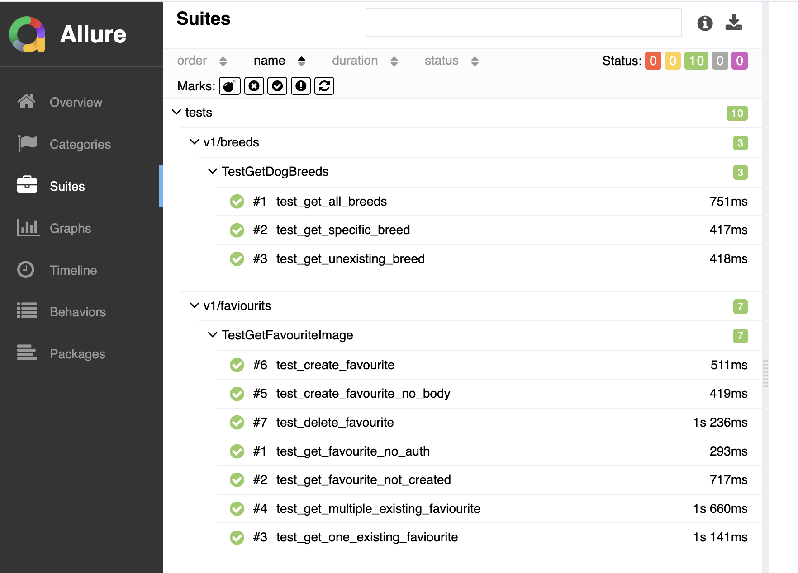

# Backend Test Automation

## Scope
Scope of this project is to validate the https://api.thedogapi.com API. Full documentation of this API can be found at https://docs.thedogapi.com/docs/intro.

Note: Some features of this API (eg. adding favourite image), require authentication through an API_KEY. Please create an account to get yours and update the .env file based on the example.

## Technical notes
- Test cases are executed in parallel, through pytest-xdist library, on 10 maximum workers (value configurable in pytest.ini)
- Failed test cases are retried, through pytest-retry library, a maximum of 3 times (value configurable in pytest.ini)
- Tests execution is generating Allure results, and a report can be built using `allure serve allure_results`.



## Project Structure
```
├── config/                # Configuration files
│   └── config.py          
├── data/                  # Test data files
│   └── labrador.json      
├── schemas/               # JSON schema validation
│   ├── breads.py           
│   └── favourites.py      
├── tests/                 # Test cases
│   ├── base_test.py       # Base test class
│   ├── test_breeds.py      
│   └── test_faviourits.py  
├── utils/                 # Utility functions
│   ├── breeds.py           
│   ├── favourites.py       
│   └── test.py            
├── allure_results/        # Allure test results folder
├── conftest.py            # PyTest configuration and fixtures
├── pytest.ini             # PyTest settings
├── requirements.txt       # Python dependencies
└── README.md              # Project documentation
```

## Setup
1. Install dependencies:
   ```bash
   pip install -r requirements.txt
   ```

2. Configure environment variables in `.env` file

3. Run tests:
   ```bash
   pytest --alluredir=allure_results -v
   ```

## Test Cases
| Test Name | Description | Test Suite | File Location |
|-----------|-------------|------------|---------------|
| `test_get_all_breeds` | Test getting all dog breeds with details | v1/breeds | `tests/test_breeds.py` |
| `test_get_specific_breed` | Test getting specific dog breed with details | v1/breeds | `tests/test_breeds.py` |
| `test_get_unexisting_breed` | Test getting unexisting dog breed | v1/breeds | `tests/test_breeds.py` |
| `test_get_favourite_no_auth` | Test getting faviourits images without autentication | v1/faviourits | `tests/test_faviourits.py` |
| `test_get_favourite_not_created` | Test getting faviourits images without creating first | v1/faviourits | `tests/test_faviourits.py` |
| `test_get_one_existing_faviourite` | Test getting faviourits images after creating one favourite | v1/faviourits | `tests/test_faviourits.py` |
| `test_get_multiple_existing_faviourite` | Test getting faviourits images after creating multiple faviourits | v1/faviourits | `tests/test_faviourits.py` |
| `test_create_favourite_no_body` | Test adding a faviourits image without body | v1/faviourits | `tests/test_faviourits.py` |
| `test_create_favourite` | Test adding a faviourits image | v1/faviourits | `tests/test_faviourits.py` |
| `test_delete_favourite` | Test removing a faviourit image | v1/faviourits | `tests/test_faviourits.py` |

### Test Coverage Summary
- **Dog Breeds API Tests (3 tests)**: Cover getting all breeds, specific breed details, and error handling for non-existent breeds
- **Favourites API Tests (6 tests)**: Cover authentication, CRUD operations (create, read, delete), and edge cases for favourite images management

## Test validations
- All test cases are validating the expected status code 
- Test cases where a more complex object is returned (eg. test_get_specific_breed) are validating response schema 
- Test cases where an object is returned validate the consistency of data against exepected values (eg. test_get_one_existing_faviourite)